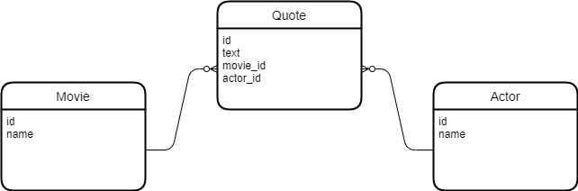

# REST API Example
A simple project for a RESTful API implemented using SpringBoot.

It uses:

* Java 11
* lombok - to avoid boilerplate codes for getters, setters, etc
* PostgreSQL
* flyway - for migration
* mockito - for tests
* docker compose
* validation

## Run with docker
```
docker-compose up
```

This will create two containers:
1. The PostgreSQL database running on port 5432
2. The SpringBoot application running on port 8080

## Build locally
From root:
```
.\gradlew build -x test
```
NOTE: Replace the .jar file in app/ with the newly generated jar file from build/libs/
The jar from app/ is used by Docker to run the application.

## The entities relationship:



### Possible paths:

Actor:
* GET localhost:8080/api/actor/{id}
* GET localhost:8080/api/actor/allpageable
* GET localhost:8080/api/actor/all
* GET localhost:8080/api/actor/{id}/quotes
* POST localhost:8080/api/actor/ - with json body for fields
* DELETE localhost:8080/api/actor/{id}
* PUT localhost:8080/api/actor/{id} - with json body for fields to update

Movie:
* GET localhost:8080/api/movie/{id}
* GET localhost:8080/api/movie/allpageable
* GET localhost:8080/api/movie/all
* GET localhost:8080/api/movie/{id}/quotes
* POST localhost:8080/api/movie/ - with json body for fields
* DELETE localhost:8080/api/movie/{id}
* PUT localhost:8080/api/movie/{id} - with json body for fields to update

Quote:
* GET localhost:8080/api/quote/{id}
* GET localhost:8080/api/quote/allpageable
* GET localhost:8080/api/quote/all
* POST localhost:8080/api/quote/ - with json body for fields
* DELETE localhost:8080/api/quote/{id}
* PUT localhost:8080/api/quote/{id} - with json body for fields to update


A Postman collection of request examples is given in the repository.
